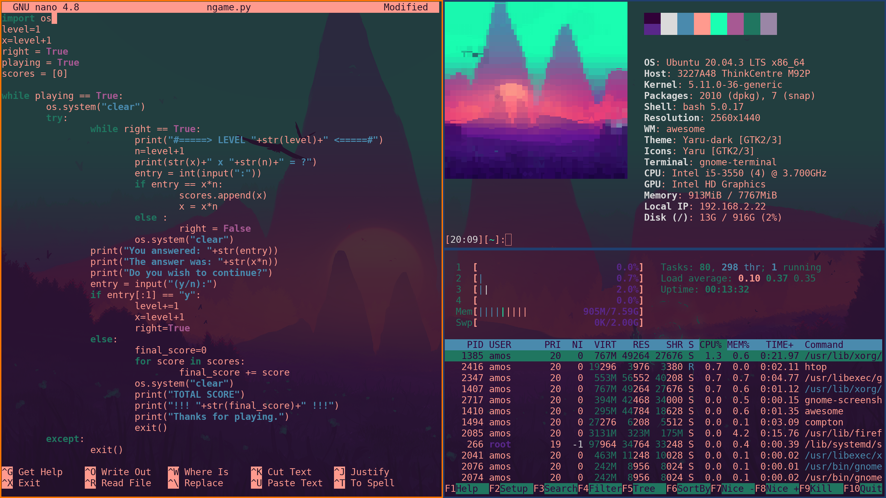

<!--  Unrar might also be of use, but seem to be non-free, so on debian it won't be on the default apt repository. -->

> Advice for new user: To use the following commands, open the "bash terminal emulator" (The __Terminal__ application.), then paste the command you wish to use, 
> once your ready to excecute it, press enter to lunch your command, then wait for it to complete it's execution, once done you can close the terminal.

> For more information on a command simply use the __man__ command followed by the name of the command in question, it will display a __manual__ of said command if it recognise it.

This repository is supose to have all the information needed to configure a new coputer to my personal preference.

# Install my bashrc
~~~
cd && rm ~/.bashrc && cd ~/ && wget "https://raw.githubusercontent.com/AmosNimos/bashrc/main/.bashrc"
~~~
> What is a Bashrc? it's a configuration file for the bash terminal emulator that is usually located in your home directory. 

# Install my shell script
> (Some of theme are use by my __.bashrc__ file and by my awesomewm __rc.lua__ file.)

~~~
mkdir ~/.shell && wget "https://raw.githubusercontent.com/AmosNimos/ani-cli/master/ani-cli" -O ~/.shell/ani-cli.sh && chmod +x ~/.shell/ani-cli.sh
~~~

# Apt Installation
> If you don't want some of those package, simply remove their name from the __apt install__ command beffore you execute it.

## Funtional
> These are programme that i consider as essential components for __my__ basic Linux usage.
~~~
sudo apt update && sudo apt install -y unzip git nano vim transmission blueman python3-pip suckless-tools sox ffmpeg neofetch mpv cmus bc sc ranger bash-completion
~~~
> If after the install, you want to know more about any of those package, simply use the __man__ command (man is for manual) followed by the package name.

### Programme Descriptions

- Git
> (Git is software for tracking changes in any set of files, usually used for coordinating work among programmers collaboratively developing source code during software development. Its goals include speed. data integrity, and support for distributed, non-linear workflows.)

- Nano & Vim
> (Nano & Vim Are two different minimalistic text editor that run on your terminal/terminal-emulator.)

- Transmission 
> (Transmission is a BitTorrent client which features a variety of user interfaces on top of a cross-platform back-end. Transmission is free software licensed under the terms of the GNU General Public License, with parts under the MIT License.)

- Blueman
> Blueman est un gestionnaire de connexion bluetooth en GTK+ pour GNOME, écrit en Python. Il est installé par défaut sur Xubuntu, Lubuntu et Ubuntu Mate. (you can lunch it from the terminal with the command: blueman-manager)

- Pip
> (Pip is the standard package manager for Python. It allows you to install and manage additional packages that are not part of the Python standard library. This tutorial is an introduction to pip for new Pythonistas.)

- Suckless-tools
> (This package provides simple commands designed to be used with a minimalistic window manager like dwm but they can be useful in scripts regardless of the window manager used.)

- Sox 
> (SoX is a cross-platform (Windows, __Linux__, MacOS X, etc.) command line utility that can convert various formats of computer audio files in to other formats. It can also apply various effects to these sound files, and, as an added bonus, SoX can play and record audio files on most platforms.)

- Ffmpeg
> (FFmpeg is a free and open-source software project consisting of a large suite of libraries and programs for handling video, audio, and other multimedia files and streams. At its core is the FFmpeg program itself, designed for command-line-based processing of video and audio files.)

- Neofetch
> (Neofetch is mainly developed to be used in screenshots of your system. It currently supports 150+ operating systems including Linux, BSD, Mac OS X, iOS, and Windows.)

- Cmus
> cmus is a small, fast and powerful console music player for Unix-like operating systems.

- Bc
> bc command is used for command line calculator. It is similar to basic calculator by using which we can do basic mathematical calculations. 

- Sc 
> sc is a discontinued, cross-platform, libre, TUI, spreadsheet and calculator application that runs on Unix and Unix-like operating systems.

- Ranger
> ranger is a console file manager with VI key bindings. It provides a minimalistic and nice curses interface with a view on the directory hierarchy. It ships with rifle, a file launcher that is good at automatically finding out which program to use for what file type.

- Bash-completion
> Bash-completion is a collection of command line command completions for the Bash shell, collection of helper functions to assist in creating new completions, and set of facilities for loading completions automatically on demand, as well as installing them.

---

## Optional
> These are programme that __I__ often use, most are Standalone and should not be required for __most__ basic linux usage.
~~~
sudo apt update && sudo apt install -y xsel w3m gedit lxappearance rofi obs-studio pavucontrol youtube-dl calibre libreoffice espeak moc wkhtmltopdf gimp inkscape jp2a xdotool
~~~

### Programme Descriptions

- Xsel
> XSel is a command-line program for getting and setting the contents of the X selection. Normally this is only accessible by manually highlighting information and pasting it with the middle mouse button.

- W3m
> w3m is a free software/open source text-based web browser and terminal pager. It has support for tables, frames, SSL connections, color, and inline images on suitable terminals. Generally, it renders pages in a form as true to their original layout as possible.

- Gedit
> gedit is the default text editor of the GNOME desktop environment and part of the GNOME Core Applications. Designed as a general-purpose text editor, gedit emphasizes simplicity and ease of use, with a clean and simple GUI, according to the philosophy of the GNOME project.

- LXAppearance
> LXAppearance is the standard theme switcher of LXDE. Users are able to change the theme, icons, and fonts used by applications easily. Starting at version 0.6. 1 it also allows to enable the accessibility features.

- Awesome
> Awesome is a an extensible, highly configurable window manager, with config file written in lua.

- Rofi
> Rofi is a window switcher, run dialog, ssh-launcher and dmenu replacement that started as a clone of simpleswitcher, written by Sean Pringle and later expanded by Dave Davenport

- Obs-studio
> OBS Studio is a free and open-source cross-platform streaming and recording program built with Qt and maintained by the OBS Project. There are versions of OBS Studio available for Microsoft Windows, macOS, and __Linux__ distributions. OBS Project raises funds on Open Collective and Patreon.

- Pavucontrol
> PulseAudio Volume Control (pavucontrol) is a volume control tool (“mixer”) for the PulseAudio sound server. In contrast to classic mixer tools, this one allows you to control both the volume of hardware devices and of each playback stream separately.

- Youtube-dl
> Youtube-dl is an open-source download manager for video and audio from YouTube and over 1000 other video hosting websites. It is released under the Unlicense software license. As of July 2021, youtube-dl is one of the most starred projects on GitHub, with over 98.2k stars.

- Calibre
> Calibre is a cross-platform open-source suite of e-book software. Calibre supports organizing existing e-books into virtual libraries, displaying, editing, creating and converting e-books, as well as syncing e-books with a variety of e-readers. Editing books is supported for EPUB and AZW3 formats.

- Libreoffice
> LibreOffice is a free and open-source office productivity software suite, a project of The Document Foundation. It was forked in 2010 from OpenOffice.org, which was an open-sourced version of the earlier StarOffice.

- Espeak
> eSpeakNG is a compact, open-source, software speech synthesizer for __Linux__, Windows, and other platforms. It uses a formant synthesis method, providing many languages in a small size. Much of the programming for eSpeakNG's language support is done using rule files with feedback from native speakers. 

- Wkhtmltopdf
> wkhtmltopdf and wkhtmltoimage are open source (LGPLv3) command line tools to render HTML into PDF and various image formats using the Qt WebKit rendering engine. These run entirely "headless" and do not require a display or display service.

- Gimp
> GIMP is a free and open-source raster graphics editor used for image manipulation and image editing, free-form drawing, transcoding between different image file formats, and more specialized tasks. GIMP is released under GPL-3.0-or-later license and is available for __Linux__, macOS, and Microsoft Windows.

- Inkscape
> Inkscape is a free and open-source vector graphics editor used to create vector images, primarily in Scalable Vector Graphics format. Other formats can be imported and exported. Inkscape can render primitive vector shapes and text.

- Xdotool
> Xdotool lets you programatically (or manually) simulate keyboard input and mouse activity, move and resize windows, etc. It does this using X11's XTEST extension and other Xlib functions. 

---

# Native games

### Gaming setup
> you might also need the contrib and non-free components to install the following games, here is how to add those components the your package source.

> Note: If you already have the __main__ repository installed you can use the folowing commands to install the other repository, the two first command, make sure they wont be installed twice by removing them first, and the last one include them after the __main__ repository.

~~~
sudo sed 's/non-free//g' /etc/apt/sources.list
sudo sed 's/contrib//g' /etc/apt/sources.list
sudo sed -i 's/main/main contrib non-free/g' /etc/apt/sources.list
~~~

Support for 32-bit architecture
~~~
sudo dpkg --add-architecture i386
~~~

# Steam installation
~~~
sudo apt update && sudo apt install steam && sudo apt-get upgrade steam -f
~~~

If you have an __Nvidea__ graphic card (btw, nvidea fuck you!) you might need to install the required proprietary driver. [How to install nvidea driver?](Nvidea-Driver-Installation.md)

## Ascii

~~~
sudo apt update && sudo apt install bastet ninvaders pacman4console nsnake greed moon-buggy
~~~

## 2D

~~~
sudo apt update && sudo apt install -y hedgewars supertux pingus teeworlds
~~~

## 3D

~~~
sudo apt update && sudo apt install -y minetest supertuxkart assaultcube redeclipse sauerbraten
~~~

### Game Description

#### 2D

- Hedgewars
> Hedgewars is a free artillery video game. Hedgewars is similar to Wormux, another free clone of Worms2,3. Hedgewars is multilingual, cross-platform and runs on GNU / Linux,

- SuperTux
> SuperTux is a free and open-source two-dimensional platform video game published under the GNU General Public License (GPL). The game was inspired by Nintendo's Super Mario Bros. series; instead of Mario, the hero in the game is Tux, the official mascot of the Linux kernel.

- Pingus
> Pingus is an open-source video game programmed by German developer Ingo Ruhnke. It is a clone of Lemmings with penguins instead of lemmings.

- Teeworlds
> Teeworlds is a free online multiplayer game, available for all major operating systems. Battle with up to 16 players in a variety of game modes, including Team Deathmatch and Capture The Flag. You can even design your own maps!

#### 3D

- Minetest
> Minetest is a free software game engine to create various games based on voxel gameplay, inspired by InfiniMiner, Minecraft, and the like.

- SuperTuxKart
> Karts. Nitro. Action! SuperTuxKart is a 3D open-source arcade racer with a variety characters, tracks, and modes to play. Our aim is to create a game that is more fun than realistic, and provide an enjoyable experience for all ages. 

- AssaultCube
> AssaultCube is a FREE, multiplayer, first-person shooter game, based on the CUBE engine.
Taking place in realistic environments, with fast, arcade gameplay, it's addictive and fun!

- RedEclipse
> Red Eclipse is an open-source arena shooter, built using the technology found in Tesseract and Cube Engine 2. Offering an innovative parkour system, distinct but all potent weapons, and fast paced accessible gameplay.

- Sauerbraten
> Cube 2: Sauerbraten is a free multiplayer & singleplayer first person shooter, the successor of the Cube FPS. 
---

## Terminal look

~~~
sudo apt update && sudo apt install -y cmatrix cava tty-clock
~~~

## Awesome install & config

> What is [Awesome](https://awesomewm.org/)?

#### Direct awesome config
> Might not be compatible with your system distribution.
~~~
sudo apt install awesome
sudo apt install compton
git clone https://github.com/AmosNimos/awesome.git ~/.config/
chmod +x ~/.config/awesome/prompt.sh
~~~

## rofi theme
mkdir ~/.config/rofi/
git clone https://github.com/AmosNimos/rofi-theme.git ~/.config/rofi/

# text editor
echo -e "set linenumbers\nset tabsize 4\nset nowrap\nset mouse\nset autoindent" > ~/.nanorc
---

The following do require more advance installation, but are higly recomended, they might also be available in your distribution de package manager.

[Pico-8](https://www.lexaloffle.com/pico-8.php)
> (💰 Non-Free)
> PICO-8 is a fantasy console for making, sharing and playing tiny games and other computer programs. It feels like a regular console, but runs on Windows , Mac , __Linux__.

[Lutris](https://lutris.net/downloads/)

> Lutris is a free and open source game manager for Linux-based operating systems developed and maintained by Mathieu Comandon and the community, listed under the GNU General Public License. Lutris has one-click installation available for games on its website, and also integrates with the Steam website..

[Atom](https://atom.io/)

> Atom is a free and open-source text and source code editor for macOS, __Linux__, and Microsoft Windows with support for plug-ins written in JavaScript, and embedded Git Control, developed by GitHub.,

---

# Sublime 3

[Sublime 3](https://www.sublimetext.com/3)
> (💰 Non-Free)

### Single line install of sublime 3
~~~
cd /tmp && wget https://download.sublimetext.com/sublime-text_build-3211_amd64.deb && sudo dpkg -i sublime-text_build-3211_amd64.deb && rm sublime-text_build-3211_amd64.deb
~~~

## Manual install of sublime 3

[Sublime Last Version](https://www.sublimetext.com/download)

> I also suggest changing the user setting to remove the auto matching.

### To stop the update warning of sublime 3

~~~
sudo echo "127.0.0.1 www.sublimetext.com" >> /etc/hosts
~~~
---

#### Avoid automatic execution
> When copying code from the web, if their is a line break __\n__ which can even be hidden in the code, it will execute automatillaly when pasted in the terminal, this can be a security issues so to avoid this i suggest using [this](https://bbs.archlinux.org/viewtopic.php?id=95548) shortcut to copy code instead it will remove line break from the selection.

~~~
echo "xsel | tr -d '\n' | xsel -i; xdotool click --clearmodifiers 2" >> .xbindkeysrc
~~~
~~~
echo "\n Control + Insert" >> .xbindkeysrc
~~~
~~~
echo "xdotool type --clearmodifiers "$(xsel | tr -d '\n')"" >> .xbindkeysrc
~~~
~~~
echo "Control + Insert" >> .xbindkeysrc
~~~

(Programmer joke)
> "__-y__ must be the most popular programme, everyone install it on linux!"
